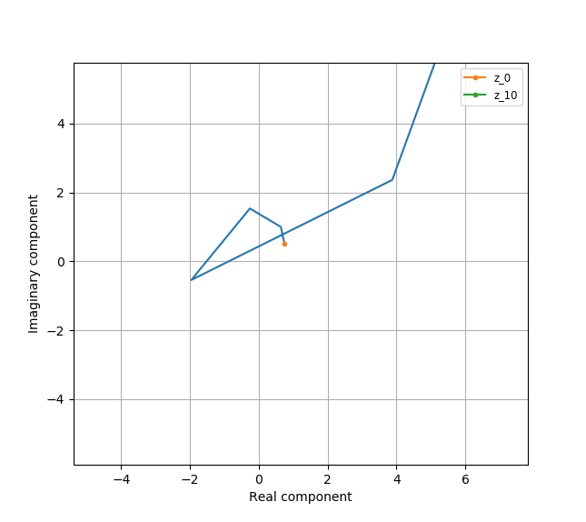
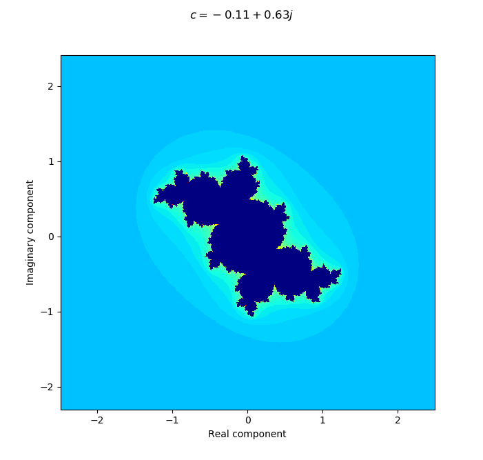
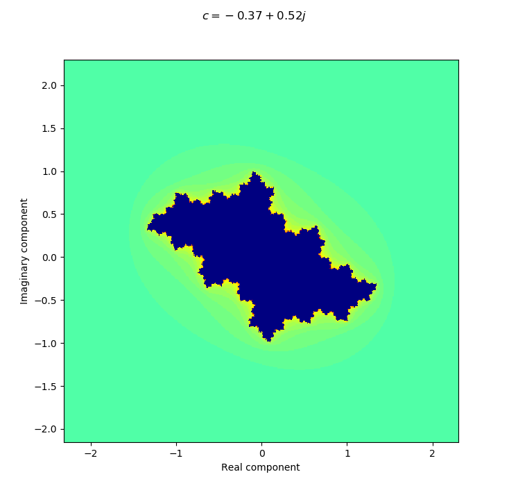
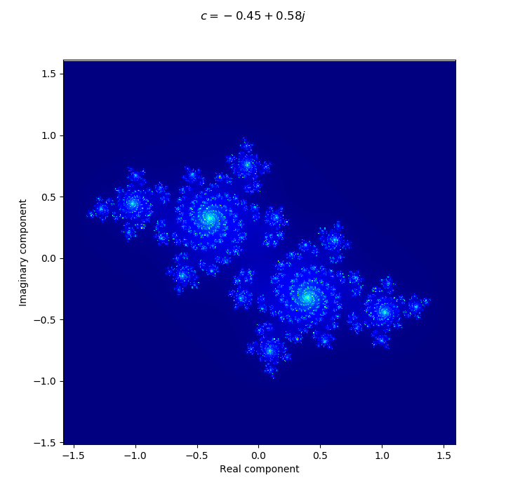
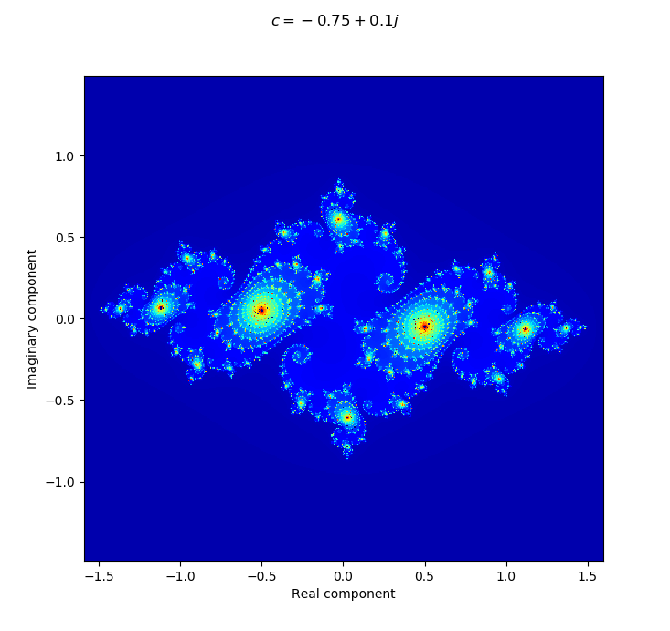
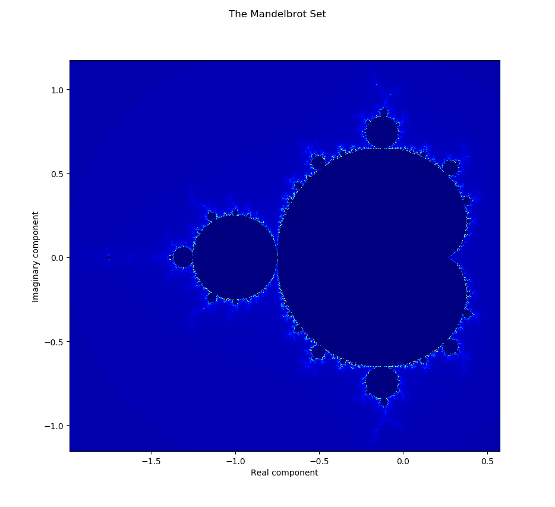
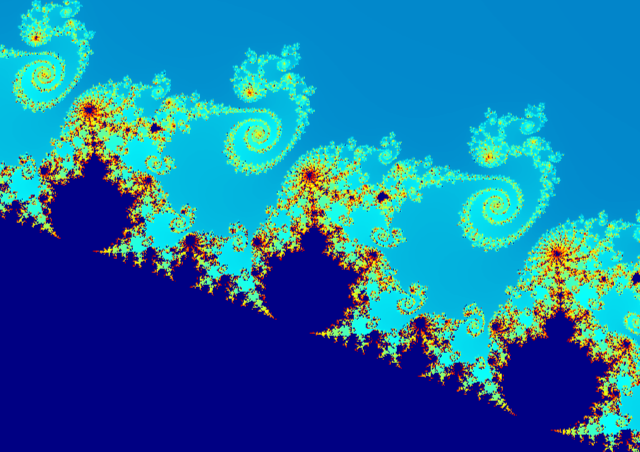
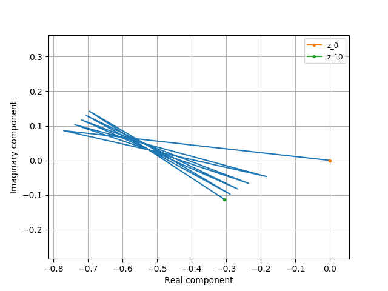

# Julia Sets
This is a simple single-page "app" that plots julia and mandelbrot sets without
needing to set up a remote server to perform the escape-time computations. 
Everything is done in the browser with simple double-precision floating-point
arithmetic.

The goal is to eventually extend this with the ability to continue diving down 
to arbitrary precision, undo/redo style navigation, and to link the Mandelbrot
plot with the corresponding Julia sets.

## Get Started

Just download/clone this repo and open up index.html in Chrome (or a 
Chromium-powered browser). This will prooobably work for Firefox, but I 
didn't really check, so caveat emptor if you decide to use that.

Clicking on the Mandelbrot plot lets you pick a value of c, and that will
update the corresponding Julia set plot. You can undo/redo zooms and pans
by clicking on the navigation arrows underneath each plot.

# What are Julia Sets?
Before explaining what a Julia set is, the first thing to do is to take a look
at this formula that defines a sequence of complex numbers:

```python
def next_z(z, c):
    """
    This function returns the next number in the sequence, defined by c
    """
    return z * z + c
```

Let's get a feel for what Julia sets are like by picking some numbers z and c,
and creating some sequences with them. 

Since I'm using Python to demonstrate this, we're going to put on our 
electrical-engineering hats and use the letter _j_ to stand for the square-root 
of -1, rather than _i_.

Let's start with a sequence that starts at z = 0.1 + 0.5 _j_, and 
c = 0.33 + 0.25 _j_. Running it through the function, we generate the following
sequence:

```python
>>> c = 0.33 + 0.25j
>>> z = 0.1 + 0.5j
>>> sequence = [z]
>>> for _ in range(10):
...     sequence.append(next_z(sequence[-1], c))
>>> sequence
[(0.1+0.5j),
 (0.09000000000000002+0.35j),
 (0.21560000000000004+0.313j),
 (0.27851436+0.3849656j),
 (0.2593717355428496+0.46443689541203204j),
 (0.18157206737854314+0.49092360722630335j),
 (0.12196242752003247+0.4282760285780236j),
 (0.16145447707201507+0.35446716818802915j),
 (0.23042057484335732+0.3644606225579925j),
 (0.2502620959157838+0.41795845231516104j),
 (0.21794184879047623+0.4591983165642188j)]
```

Oof, staring at all of those numbers hurts my head-brain, so let's plot it
instead. In the following plot, I've plotted the real parts of those numbers on
the horizontal axis, and the imaginary parts of those numbers on the vertical 
axis.

```python
>>> import numpy as np
>>> import matplotlib.pyplot as plt

>>> plt.plot(np.real(sequence), np.imag(sequence))
>>> plt.show()
```


We started at the orange dot, and at the end of this sequence, we are now at 
the green dot. If we continue this sequence on to infinity, the value of z will
continue to "spiral" in to the center until it reaches 0.0.

However, not all values of z will converge under this sequence. Keeping our value
of c = 0.33 + 0.25 _j_, let's pick a value z = 0.75 + 0.5 _j_

Plotting this guy's trajectory, we can see that it blows up rather quickly:



Again, we start off at the orange point, and in just
5 steps, the value of z has already grown large enough that we can't even see it on 
the plot anymore. If we infinitely continue this sequence, the value of z will just 
continue to grow and grow and grow until it too reaches infinity.

Because of this, we can definitively state that the value z = 0.75 + 0.5 _j_ does 
_not_ belong in the Julia set defined by c = 0.33 + 0.25 _j_

Thus, to construct the Julia set, all you have to do is: for every number z that you 
can think of, see if it blows up to infinity if you repeatedly apply the formula 
above. If it doesn't, then it's part of the Julia set.


## Plotting Julia Sets
Up to this point, I have been imprecise in using the term "the Julia set", which 
implies that there is only one single Julia set. This is not true. There are 
infinitely many Julia sets, and each one of them is defined by the value c.
Thus, if you set the value c = 0.2 - 0.3 _j_ for example, that defines a particular
Julia set, whereas if you set the value c = 0.4 + 0.5 _j_, that defines a different
Julia set. The value c is responsible for determining which numbers belong and
which numbers do not belong to the set that it defines.

The reason that Julia sets have gained such popular attention is the fact that when
you plot them on the complex plane, the shapes that you get are infinitely complex
and beautiful. The governing principle of it is quite simple, but the implications
are astoundingly complex and enticing.

As stated above, Julia sets are defined by their value c, and different values of c 
define different Julia sets. Let's take a look at some of them. In the resulting 
plots, I've picked different different values of c and plotted the corresponding
Julia sets for those values. Numbers that belong to the set are plotted as dark blue 
points. Numbers that don't belong to the set are plotted in other kinds of colors 
(the meaning of which will be explained later). Real components are plotted on the 
horizontal axis, and imaginary components are plotted on the y-axis.

### c = -0.11 + 0.63 _j_



### c = -0.37 + 0.52 _j_



For these next two images, I couldn't get the color-mapping to work correctly. The
dark-shaded blue regions do not belong to the Julia set. Rather, the points that 
belong to the Julia set are the areas where you see concentrations of bright color.

### c = -0.45 + 0.58 _j_



### c = -0.37 + 0.52 _j_



# Relation to the Mandelbrot Set

The Mandelbrot set is probably **the** most famous fractal set, and what it 
stands for can now be more fully understood now that we understand what Julia
sets are.

Before we proceed, let's just take a moment to gaze upon the Mandelbrot set. 



It always fascinates me whenever I look at it because it's all so much like the
world we live in, yet so much not like it as well. Familiar because it has many
features that reminds me of things that I see around me: those little structures 
shooting from the tips of the "buds" protruding from the sides look like prongs
of lightning. Zooming into the valleys in between these buds, I see little chains
of islands that look like seahorse tails, crinkly leaves of lettuce, and forests
of tree-like substructures lining the walls of the valleys. And yet, at every 
level, it also looks nothing like anything we see in the physical world. It's
uniquely its own thing; a strange chimaera of everything we perceive in the world
around us.



Anyways, before I become any more pompous, let's briefly discuss the relationship
between Julia sets and Mandelbrot sets.

Recall that Julia sets are defined by the parameter c. Whatever value c is 
determines the "shape" of the corresponding Julia set. 

The Mandelbrot set is instead defined by setting the value of z = 0, picking a value 
for c, and seeing if the sequence defined by the function `next_z` blows up or 
converges. If the sequence blows up for the chosen value of c, that value of c does 
not belong to the Mandelbrot set. If the sequence does not blow up, then the value 
of c belongs to the set.

So, to just make things absolutely clear, let's set the value c = -0.77 + 0.086 _j_. 
The sequence that follows is:

```python
>>> z = 0.0
>>> c = -0.77 + 0.086j
>>> sequence = [z]
>>> for _ in range(10):
...     sequence.append(next_z(sequence[-1], c))
```

Plotting `sequence`, we see the following trajectory:



As always, we started at the orange dot and ended on the green dot. It's hard to 
tell in this plot since the trajectory oscillates rather vigorously between two 
general modes, but this trajectory is somewhat stable, and does not blow up
when iterated ad-infinitum. Thus, we can state that c = -0.77 + 0.086 _j_ belongs
to the Mandelbrot set.

Again, repeat this experiment with every number in the complex plane, and you will
then be able to determine if that number belongs in the set.

Also, note that I am using the term "the Mandelbrot set" accurately this time. 
There is only one Mandelbrot set, not the many there are for Julia sets; and 
that's because the Mandelbrot set is not parametrized (well, not really. You 
could argue that it's parametrized by the first value of z, or the power that you 
raise it to to generate the next member of the sequence, but I'm just going to go
with the convention that is more generally used and call this **the** 
Mandelbrot set).

There are some interesting relationships between the Mandelbrot set and the Julia
sets. If you pick a value of c that is "inside" the Mandelbrot set, the corresponding
Julia sets tend to be more "blobby" and continuous. Whereas, if you pick a value c
outside of the set, the corresponding Julia set becomes more like a fine "dust"; 
rather than a single (or many) contiguous region(s), it becomes a collection of 
disconnected points. And the further away from the edge of the set you go, the finer 
that dust becomes. In fact, in the Julia set plots that I provided above, the first
two were chosen from points that were inside the Mandelbrot set; you can see that 
they look much more like regions of solid color. Whereas the second two were chosen
from points that were outside of the set. 